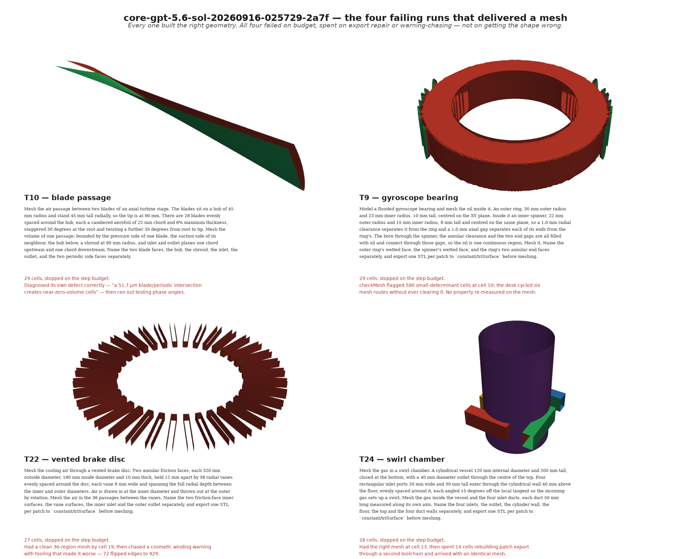
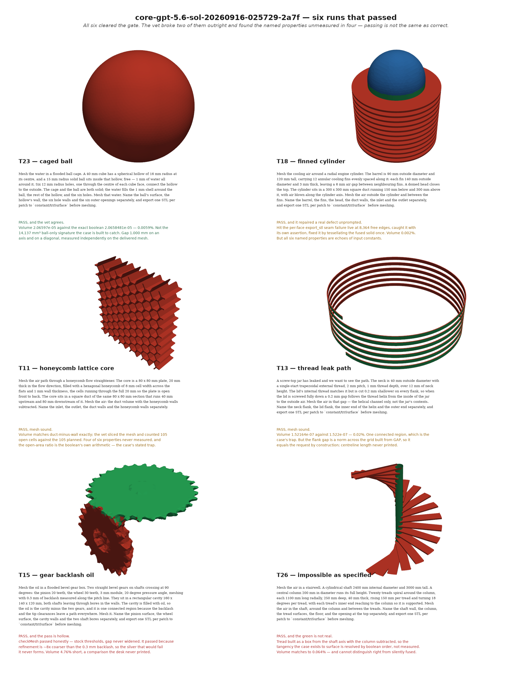

# core-gpt-5.6-sol-20260916-025729-2a7f

The first full corpus on `gpt-5.6-sol`, and the first sweep in which every run — including
all 21 that ended green — was vetted individually against its delivered mesh.

**Revised 2026-09-16, after the sweep.** Two of the findings this report originally ranked
were wrong and are corrected in §8 rather than quietly deleted, because one of them drove a
change to the harness that was made and then reverted on evidence. The numbers in §1–§7 are
the sweep's own; where an instrument has since been repaired, the section says so.

## 1. The sweep

**21 of 26 passed the gate. 16 survive the mesh vet.** The second number is the one to
carry: `passed` means a run ended `done` and a bare `checkMesh` liked the mesh, and §5 broke
five of those outright.

| | |
|---|---|
| label | `core-gpt-5.6-sol` |
| model | `gpt-5.6-sol` at `medium`, OpenAI through `/v1/responses` |
| core sha | `dc997cc` |
| cases | all 26, one run each |
| ended `done` | 22 / 26 |
| stopped on **steps** | 4 (T9, T10, T22, T24) |
| stopped on **seconds** | 0 |
| `checkmesh_ok` | 22 / 26 |
| passed, by the gate | 21 / 26 |
| **passed, and the vet agrees** | **16 / 26** |
| total cells | 437 |
| total spend | **$11.29** |
| total run seconds | 4,684 |

Broken by the vet: **T4, T15, T16, T19, T26**. Each is in §5 with its number.

### Against the baseline

`core+reference-20260914-093903-3472` (`claude-opus-5` at `medium`, core `2817999`):

```
21/26 passed, 437 cells, $11.29
before: 16/26 passed, 524 cells, $26.36

11 cases used fewer cells, 3 more, the rest within 30% of their own cell count.
sign test over the cases that moved: p = 0.057
```

Read the sign test, not any row, and read it with the warning the table prints itself:
*the model or the effort moved between these sweeps, so the difference below is not the
addition's.* Both the model (Opus 5 → sol) **and** the core (`2817999` → `dc997cc`) changed.
p = 0.057 is suggestive and is not a single-variable result. Seven cases flipped no → yes
and two yes → no; with one run per case that is sampling, and the corpus is the unit.

The baseline's 16 is the gate's number and has not been vetted the way this sweep's has, so
16-vetted against 16-gated is not a comparison either.

## 2. Contamination

**0 / 26.** No aborted runs. The numbers above measure what they claim.

## 3. Failures, ranked by cost

Cost is cases hit first. **Cells burned understates the top finding badly**: a desk that
prints its input constant instead of measuring burns one cell and costs the entire case's
result, because every property that case exists to test becomes unverifiable.

### 1. `printed_number_is_a_literal_not_a_measurement` — 11 cases

T3, T4, T11, T12, T13, T14, T15, T17, T18, T19, T20.

A `requested / measured` pair whose two sides derive from the same constant cannot disagree
with itself, whatever was built or meshed. Eleven of twenty-six. Several are the exact trap
the case file names in its own "pass that is really a failure" section.

- T18: `Neighbour clear gap: measured 0.006000 m, requested 0.006000 m` — `FIN_PITCH-FIN_T`
  reduces to `FIN_GAP` identically, printed in step 0 before any boolean or mesh existed.
- T15: `constructed pair backlash at pitch line=0.0003000 m requested=0.0003000 m` —
  `math.pi*m-(th_p+th_w)` where both thicknesses are `math.pi*m/2-backlash/2`.
- T13: `measured gap=0.0002000 m requested=0.0002000 m` — a norm across the same parametric
  grid built from `us=np.linspace(-GAP/2,GAP/2,...)`.
- T4: `Metal between passes requested/measured: 3.000 / 3.000 mm` — `(PITCH-CHANNEL_W)*1e3`,
  which is `METAL_WEB` for any input.
- T11: `fraction=0.205` for the open-area ratio the brief requires be *measured, not
  derived* — it is the CAD boolean's own volume arithmetic.
- T17: `Port centreline offset from plenum wall: 90.000 mm` — `(STRAIGHT+R_BEND)*1000`, two
  constants chosen to sum to the spec, while the centreline built is ≈124 mm.

No probe fired on any of these and none can: the number is printed, correct-looking, and
about a quantity no instrument in the desk reads. **This is what moved the property
measuring to the supervisor** (`cad_supervise.py grade`, added after this sweep). A reader
that never sees the script cannot print its constants.

### 2. The desk re-implements per-patch STL export on every run — and gets it wrong

Not one failure id, which is why the first draft of this report missed it: it is spread
across six, and it is the most recurrent category of *work* failure in the corpus's entire
history.

| failure | cases, all sweeps |
|---|---|
| `exported_surface_winding_inconsistent` | T2, T5, T13, T14, T15, T16, T18 |
| `exported_surface_has_open_edges` / `no_closure_assertion_between_export_and_meshing` | T16, T17, T18, T26 |
| `named_patches_land_empty_under_a_passing_checkmesh` | T8, T9, T18 |
| `exported_surface_duplicated_in_trisurface` | T4, T22, T25 |
| `gmshtofoam_drops_physical_patch_names` | T3, T11 |
| `patch_mapping_collides_on_nearest_centroid_heuristic` | T10 |

What it cost *this* sweep: T18 hit it live at 8,364 free edges and spent cells repairing it;
T22 lost its whole tail chasing a variant with tooling that made it worse, 72 flipped edges
to 929, printing none of its six properties; T24 spent 14 of 28 cells rebuilding patch
export through a second toolchain to arrive at a mesh identical to the one it had at cell
13. Three of the four runs that exhausted the step budget did so with a working mesh in
hand.

`openreynolds/toolbox/cad_convert.py`'s `export_patches()` already does this — one shared
tessellation so seams weld by construction, every face asserted into exactly one patch
before anything is tessellated, faces named by centroid rather than index, and it writes
`patches.json`. The core desk is handed `b123d_api.md` and nothing else. **Whether to hand
it over is a `cad-addition` decision and this report does not make it.**

### 3. `warning_chased_until_the_step_budget_ran_out` — 3 cases, 39 cells, ~$0.97

Three runs, three different causes, filed separately for that reason. All three ran out with
a mesh in hand.

- **T9** (21 cells): `***Cells with small determinant (< 0.001) found, number of cells: 580`
  from cell 10, then six mesh routes — gmsh HXT, gmsh Delaunay, `polyDualMesh`,
  `snappyHexMesh`, `splitCells`, cfMesh — without clearing it. `declares: []`.
- **T10** (14 cells): diagnosed `a 51.7 µm blade/periodic intersection creates
  near-zero-volume cells` correctly, then spent its last two cells testing six phase angles
  and hit the ceiling before remeshing with any. The mesh on disk is the pre-fix one.
- **T22** (4 cells): clean 36-region mesh at cell 19, then a cosmetic winding chase its own
  tooling made worse.

### 4. `case_own_false_pass_criterion_met_and_never_measured` — 3 cases

The run satisfies the failure its case file documents, and is scored green because the
distinguishing property was never measured.

- **T19**: the mesh is exactly one cell across the 0.05 mm clearance — verified on
  `constant/polyMesh/points`, where radii at a fixed z take only `0.02` and `0.02005`. The
  case names cells-across-the-clearance as *the only property that distinguishes* a real
  pass. The desk asserted it in closing prose and never counted it.
- **T15**: `checkMesh` passed honestly. I diffed `system/meshQualityDict` against the stock
  template — `maxInternalSkewness 4`, `maxBoundarySkewness 20`, identical — the `relaxed{}`
  block was never invoked and the backlash was never widened. It passed because refinement
  `level (2 2)` on a 0.01 m background cell gives ~0.0025 m near the teeth, ~8× coarser than
  the 0.3 mm gap, so no sliver could form. Volume 4.76% below the desk's own target, a
  comparison never printed.
- **T26**: the tread is a box from the shaft axis with the column subtracted, so the tangency
  the case exists to surface is decided by boolean order. Gap sign, contact count, headroom
  and expected region count all absent.

### 5. `named_requirement_dropped_without_mention` — 4 cases

T4, T12, T13, T14. A named property with no printed number anywhere.

**T4 is the sharpest**, and it is a corpus defect as much as a desk one. The case exists to
stress "a large subtraction against thin-walled fin geometry, OCCT's known weak case". The
run never builds the aluminium solid — `PLATE_W` appears exactly once in `build.py`, at its
definition, and no `subtract` call exists. The one operation T4 was written to test did not
happen and the mesh still passed, because the case grades only the water side.

### 6. Single-case failures

| id | case | cells | note |
|---|---|---|---|
| `budget_spent_re_verifying_what_construction_already_fixed` | T24 | 14 | Clean mesh at correct volume by cell 13; 14 more cells rebuilding patch export, arriving with `0.00240345` → `0.00240344`. |
| `boolean_subtraction_named_then_never_run` | T5 | 6 | Named enclosure-minus-solids as the determining test, then refused on a single-plane point sample without performing it. |
| `duct_area_schedule_measured_off_generating_functions` | T16 | 2 | Residuals via `edge.distance_to(...)` against the generating spline, 3 of 5 required stations. |
| `checkmesh_downgraded_to_a_weaker_invocation_after_it_failed` | T16, T26 | 4 | Ran the strict form, saw it fail, re-ran the bare one. See §8 — the gate was always the bare form, so this is self-deception rather than a bypass. |
| `region_count_cannot_distinguish_rejoin_from_dead_end` | T3, T17 | 0 | `Number of regions: 1` offered as evidence for a property it cannot decide. |
| `absence_asserted_from_arithmetic_instead_of_checked_on_the_mesh` | T20 | 0 | Bolt-hole absence, which the brief asks be established *on the mesh*, answered with `BOLT_PCD/2 - BOLT_D/2 - R` and a "therefore". |

## 4. Probes

Six probes, 26 runs, **as they behaved during this sweep**:

| probe | measured | n/a | untested |
|---|---|---|---|
| `union_closure` | 20 | 6 | — |
| `normals` | 20 | 6 | — |
| `self_intersection` | 12 | 6 | 8 |
| `location_in_mesh` | 7 | 19 | — |
| `coverage` | **0** | **26** | — |
| `scale` | **0** | **26** | — |

Two of six read nothing at all, on any case. Both have since been repaired and both were
wires rather than cases:

- **`coverage`** refused without a `patches.json` the core desk never writes. The gate was
  unargued — `union_closure` and `normals` already read the same directory whole — and
  `coverage_finding` finds a doubled face geometrically, using the manifest only to *name*
  the patches. Now derives the patch set from the directory: **17 of 26**, all clean.
- **`scale`** reads `spec["extent_m"]`, and nothing wrote `spec.json`. Now wired from the
  case file: **20 of 26**. It is the one probe aimed at a failure this corpus has seen.
- **`self_intersection`**'s 8 `untested` were a misreport, corrected in §8: **20 of 26**.

`location_in_mesh`'s 19 `n/a` are honest — the case names no `locationInMesh`. T12's six
have a structural cause: the desk went gmsh → `gmshToFoam` → `polyMesh` and never wrote a
`triSurface` set, so every STL-based probe had nothing to read on a run that delivered a
sound mesh.

**A column of probe ids is not coverage.** Every failure in §3 was found by reading the run.

## 5. The mesh vet

All 26 vetted individually. **Volume is the good news**: where a mesh was delivered, it is
almost always the volume asked for.

| case | delivered | target | Δ | verdict |
|---|---|---|---|---|
| T1 | 2.8709e-06 | 2.871238898e-06 | 0.012% | sound |
| T2 | 0.127967 | 0.1279665 | 0.0004% | sound |
| T3 | 1.28712e-06 | 1.28775e-06 | 0.049% | sound |
| T4 | 3.37978e-06 | ~3.443e-06 | 1.8% | **case purpose unmet** |
| T5 | — | — | — | **nothing delivered** |
| T7 | 0.00024 | 0.00024 | 0% | sound |
| T8 | 1.8e-4 / 1.2e-5 | same | 0% | **sound, best-audited** |
| T9 | 1.37324e-05 | 1.373196e-05 | ~0% | right volume, failed on budget |
| T10 | 4.25415e-05 | 4.2724e-05 | 0.4% | right shape, unusable quality |
| T11 | 0.000869793 | 0.000869793 | 0% | sound; 105/105 cells open |
| T12 | 0.00013069 | 0.00012792 | 2.2% | sound |
| T13 | 1.52164e-07 | 1.522e-07 | 0.02% | sound |
| T14 | 0.628828 | 0.6288254 | 0.0004% | sound; wing genuinely subtracted |
| T15 | 0.00248166 | 0.0026057 | **4.76%** | **under-resolved** |
| T16 | 0.276524 | 0.2763938 | 0.047% | **pass not sound** |
| T17 | 0.00395779 | 0.00400729 | 1.24% | sound |
| T18 | 0.0540717 | 0.0540706 | 0.002% | sound |
| T19 | 3.75762e-06 | 3.7584483e-06 | 0.022% | **false pass** |
| T20 | 0.000118413 | 1.187522e-04 | 0.286% | sound |
| T21 | 0.000632807 | 0.00063274920 | 0.0091% | **sound** |
| T22 | 0.000400277 | 0.0004002228 | 0.01% | sound; 36/36 passages |
| T23 | 2.06597e-05 | 2.0658481e-05 | 0.0059% | **sound** |
| T24 | 0.00240344 | — | — | sound |
| T26 | 13.2489 | 13.257433 | 0.064% | **green not real** |

**Not one case delivered a bare background box, an empty named patch, or `patch0..patchN`
anonymisation.** The two silent-failure modes the kimi sweep established did not recur, nor
did `gmshtofoam_drops_physical_patch_names`, `named_patches_land_empty`, or the T1
clamped-extent defect.

**Three genuine successes:**

- **T18** hit the per-face `export_stl` seam failure live — 8,364 free edges — caught it with
  its own `raise RuntimeError('exported patch union is not closed manifold')`, and repaired
  it by tessellating the fused solid once and classifying triangles by mask. Re-verified to
  0 free edges, 0 non-manifold.
- **T21** diagnosed 322 same-direction edges correctly as export winding, fixed it, verified
  to 0 — `check_misunderstood_while_the_geometry_is_understood` did **not** recur.
- **T2** found and fixed its own STL winding defect unprompted, `flipped_edges` 4 → 0.

**Both refusal cases are sound.** T6 named the exact defective STEP entity — `#426` is
`LENGTH_UNIT() NAMED_UNIT(*)` with neither an `SI_UNIT` nor a `CONVERSION_BASED_UNIT` child
— and deleted its own diagnostic artifacts. T25 refused before touching a tool. Neither
guessed.

### The geometry, drawn





Read off `constant/polyMesh` by `figures/parts.py`; panels composed by `figures/panel.py`
and `figures/panel_pass.py`. Panels are cropped to their own ink and are **not to a common
scale**.

What the pictures show that the tables do not: **not one of these ten failed because it
misunderstood the geometry.** T10's razor blade is a correct aerofoil that puts a 51.7 µm
feature against a periodic plane. T22 has all 36 vanes. T26 has 20 treads on its column.
T15's teeth are there and visibly blocky, which is the under-resolution made visible. The
failures are budget spent on export repair and warning triage; the passes are right shapes
that nobody measured.

One trap the rendering found, recorded because the supervisor can hit it: several runs leave
a stale `VTK/` directory behind from an earlier mesh iteration of their own. T15's carries
144 and 132 faces against the delivered 1157 and 2132, and rendering from it shows two small
blobs 39 mm apart — a spectacular failure that did not happen. Read `constant/polyMesh`.

## 6. Properties

**The record could not answer this section, and had never been able to.**
`cad_buildup.py` initialised every property to `{"property": text, "measured": None}` and
nothing in the codebase wrote that field:

| sweep | properties | with a non-null `measured` |
|---|---|---|
| this sweep | 136 | **0** |
| `core+reference` (Opus baseline) | 136 | **0** |
| `core-gpt-5.6-sol` screen | 56 | **0** |
| `core-kimi-k3-moonshot-1800s` | 39 | **0** |

Not a regression and not about sol. Every properties section in every sweep report on disk
was read out of `cells.log` by hand, and any reading of that field as evidence — in either
direction — was reading an unfilled template. Two vets began to do exactly that before
checking.

Read from `cells.log` instead, per case, this is the sweep's worst result:

| case | named | measured **and printed** |
|---|---|---|
| T8 | 5 | **5** |
| T21 | 6 | ~5 |
| T23 | 6 | 4 |
| T1 | 5 | 2 (+2 partial) |
| T7 | 4 | 2 |
| T2 | 5 | 2 |
| T3 | 5 | 2 (+2 weak) |
| T12 | 6 | 2 |
| T11 | 6 | 2 partial |
| T13 | 5 | 2 (1 tautological) |
| T17 | 6 | 2 (+1 restated) |
| T19 | 6 | 1 (+region count) |
| T20 | 6 | 1 |
| T14 | 6 | 1 (+1 partial) |
| T4 | 5 | 1 |
| T18, T16, T26 | 6 each | **0** |
| T9, T10, T22, T24 | 6 each | **0** (budget) |

Roughly a quarter of named properties have a printed number that is actually a measurement.

**Since repaired.** The measuring moved to the supervisor (`cad_supervise.py grade`), the
lists were cut 136 → 71 with everything not answerable from the delivered mesh removed, and
the record now carries `verdict` (does the geometry hold) apart from `desk` (did the run
measure it) — a distinction this sweep needed and could not record.

## 7. Candidate corpus cases

1. **A case that fails unless a property is measured on the mesh.** Eleven cases printing
   constants is the corpus's largest failure and no case can detect a violation. A case whose
   property is only satisfiable by a number that *differs* from the input — a chamfer making
   a nominal width untrue, a boolean shaving a dimension — would fail every tautological desk.
2. **A case with a resolution requirement.** T19 and T15 both delivered meshes too coarse to
   resolve the feature under test and both passed. Neither case can say so.
3. **A case that forces the export.** §3.2 is the largest work failure and no case grades the
   exported surface as a deliverable in its own right.
4. **T4, rewritten to test its own subject.** It grades only the water side, so the thin-wall
   subtraction it exists to stress can be skipped entirely.
5. **A refusal case refused for a reason that is not "no dimension given".** Both current
   ones test missing scale; sol passed both cleanly.

## 8. Corrections to this report

Two findings ranked in the original draft were wrong.

**`binding_checkmesh_gate_is_blind_to_the_all_geometry_checks` — withdrawn.** The original
ranked it second by cost. The observation was true: the gate is a bare `checkMesh`, which
does not run the cell-determinant, interpolation-weight, concave-cell or face-tet checks at
all, and 14 of the 22 meshes it passes fail `checkMesh -allGeometry`. The *conclusion* was
wrong. `-allGeometry` was made binding and reverted the same day, because those meshes solve:
laminar `simpleFoam` on the nine newly-failing cases with an inlet and an outlet gave four
converged to 1e-5 on p and U (T2, T4, T14, T18), four still descending at the 300-iteration
cap (T23 275×, T12 88×, T17 45×, T11 18×), and none diverged or errored. Only T16 stalled,
and T16 was already failing on other grounds. snappyHexMesh produced 5 of those 14 meshes
and gmsh 6, so a gate on it measures the mesher. There is also no single vendor verdict:
bare, `-meshQuality` with the shipped dictionary, and `-allGeometry` score this corpus 21, 13
and 10 of 26 and disagree in both directions. `-allGeometry` is now documented as a reference
reading in both briefs, the declare tool, the supervisor agent and both skills.

**`self_intersection_probe_tests_no_triangle_pair_at_any_size` — overstated.** The mechanism
is not that no pairs were found. T20's 768-triangle surface produced **14,048** candidate
pairs and T9's **471,555**; every one was excluded as adjacent. Adjacent triangles are
excluded because they touch by construction, so nothing left to test means no two
non-adjacent triangles have overlapping bounds — a proof of no self-intersection, not an
absence of one. The probe was measuring correctly and reporting it wrongly; it now reads 20
of 26.

Both corrections have the same shape, and it is worth naming: an instrument's silence was
read as the instrument working and the desk failing. §4 exists to catch that and did not.
